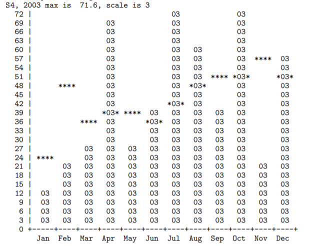

# Rainfall data processing

## What it does

This project will work on the datafiles of rainfall records, retrieved directly from [The Bureau of Meteorology website](http://www.bom.gov.au/climate/data/). Specifically, the project will identify trends that may exist in the input data, and allow visualization on the data.

## How it works

### Stage 1: Data read

The data will be read into internal structures suitable for use in the later stages, and create an output representation that provides an overview of the data that was read. Also, users need to be aware that there may be missing data lines that are completely typical of sensor-based data, and occur because of equipment malfunction, network errors, and so on.

An example line of the output:

`S1, 2001: Jan Feb Mar ... May Jun Jul Aug Sep* Oct Nov* Dec`

`*` indicates a value that has not been validated, and `...` indicates a completely missing value.

### Stage 2: Annual rainfall

Add further functionality so that for each month of the year the average rainfall is computed and reported. All months for which at least one data item is available will be listed, and unverified items will also be counted and included in the average. Sample output:

    `
    S2, Jan, 10 values, 2000-2009, mean of 23.5mm
    S2, Feb, 10 values, 2000-2009, mean of 45.5mm
    S2, Mar,  9 values, 2000-2009, mean of 33.8mm
        <plus lines for the other eight months>
    S2, Dec, 10 values, 2000-2009, mean of 48.6mm
    `
    
### Stage 3: Trend analysis

This step will point out if there is an overall downward or upward trend over the rain values, using [Kendall's Tau](https://en.wikipedia.org/wiki/Kendall_rank_correlation_coefficient). Each tau value will be computed from the sequence rainfall value that represents the rainfall for one specific month across the span of years available in the data. No value will be reported if there are less than two values for that particular month in the input file. Sample output:

    `
    S3, Jan, 10 values, 2000-2009, tau of -0.11
    S3, Feb, 10 values, 2000-2009, tau of -0.11
    S3, Mar,  9 values, 2000-2009, tau of -0.11
    <plus lines for the other eight months>
    S3, Dec, 10 values, 2000-2009, tau of 0.36
    `
    
### Stage 4: Graphing

From the processed data, a graph will be drawn, with the two digits used in each
bar are the last two digits of the year number that is being plotted, and `****` represents the average value of that month. An example output:

*Details of the desciption are taken from The University of Melbourne, Department of Computing and Information Systems, 2019*
